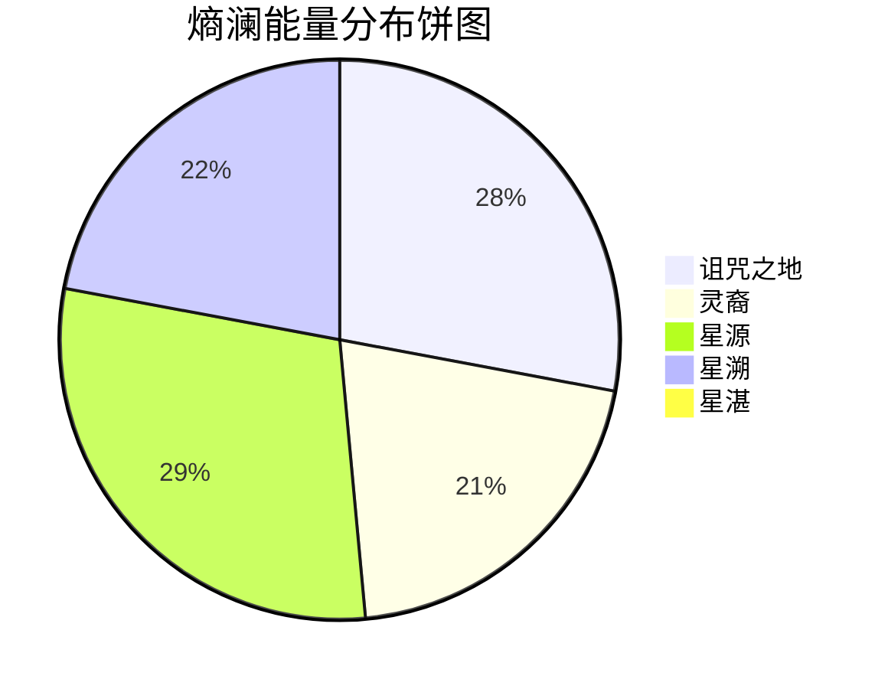

# 概念

*我是词条编辑者，对于词条概念来说我就是它们的神，所以我又何尝不是一种概念神（*

## 能量形式

### 熵澜能量

一种飘渺的小分子能量，可以被科技通过靶向改变分子结构，融入生命，为意识体所用。和魔法有几分相似，不过它的施展仅限于生物。它的施展门槛不高，即便实力平平的生物也能使用，低级附着体可以被高级形态附着体（星源 - 灵裔），自身意识和行动都将受到其支配。拥有一种特殊的类似松木的味道。有的生物也许生来就会带上部分熵澜能量的属性？理论上来说，只要生来足够强大，就可以控制整个[宜居星球α](../locations/index.md#α-星)。

“那诅咒之地也没种树啊，为什么会有木头的味道？”——新晋拓扑研究员
“而且...那些...（哎你过来！说什么呢）...”

——正欲附和的老调查员和新晋研究员被[财团](../organizations/index.md#欧加斯财团-the-ogas-consortium)的人带走，几天后只剩下了一份“人事变动通知”...

*详细内容待补充*