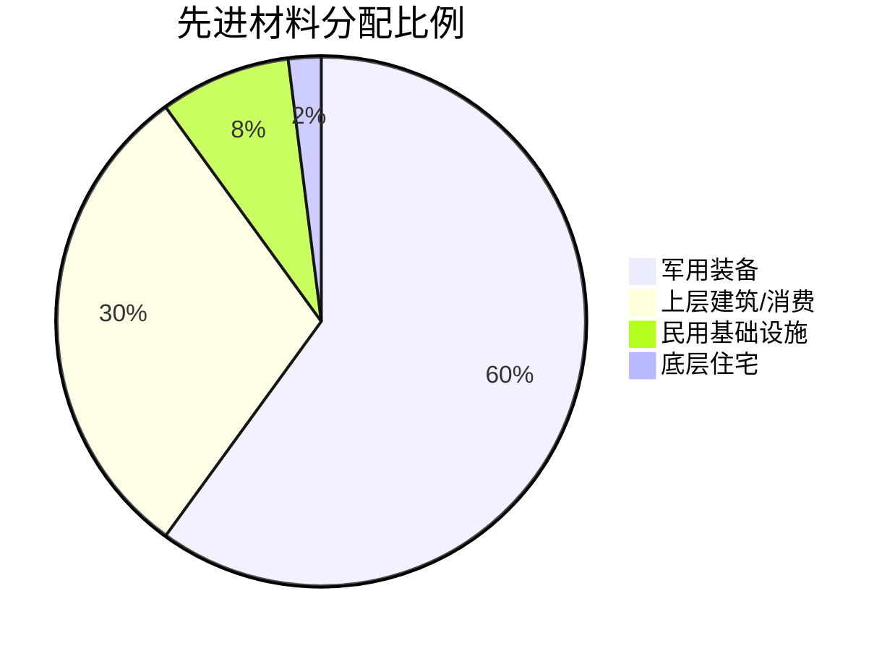
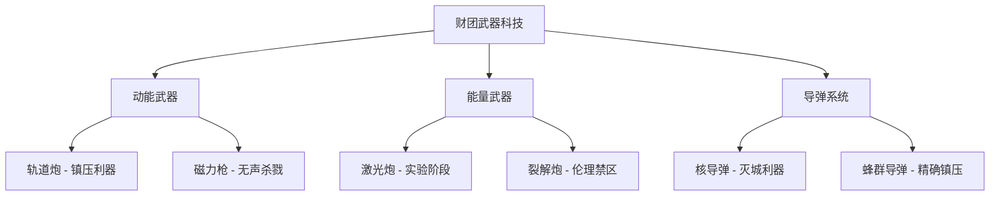
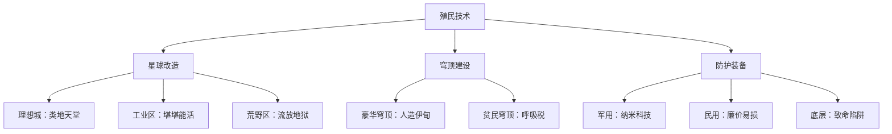

# 人类科技树

> **"他们说技术让世界更美好，但从未说是让谁的世界更美好。"**  
> —— 某位在第三街区净化行动中失踪的底层工人


## 概述

在双星文明的辉煌表象之下，[欧加斯财团](../organizations/index.md#欧加斯财团-the-ogas-consortium)通过对技术的绝对垄断，构建起了一个精密的压迫机器。从星际殖民到基因编辑，从能源分配到信息管制，每一项"先进技术"都成为了维护统治、榨取利润的工具。

财团掌握着人类最顶尖的科技，却选择**故意保留大量人力劳动**——不是因为技术不够先进，而是因为**廉价劳动力比全自动化更能最大化利润，同时维持人口对财团的依赖性**。这种选择深化了阶级对立，最终埋下了财团衰亡的伏笔。

技术本身是中立的。但在资本的手中，它既可以是福音，也可以成为枷锁。


*图：人类科技树全景 — 光辉背后的阴影*


## 🏭 生产学

> **财团官方宣传**：*"我们的先进生产技术为两颗星球的数十亿人口提供了充足的物资保障，创造了无数就业机会，是现代文明的基石。"*

> **真实现状**：财团通过半自动化生产体系，在保持高效产出的同时，故意保留大量低薪工人岗位，形成了一个庞大的劳动力剥削网络。底层民众在恶劣的工作环境中，用生命和健康换取勉强维生的薪水。

### 太空生产

#### 🛰️ 空间站

**发展水平**: ⭐⭐⭐⭐⭐ (技术成熟)  
**财团控制度**: 🔴 完全垄断

分布在α星和β星轨道及拉格朗日点的大型空间设施，是财团太空活动的核心枢纽。包括大型研究站、半自动化工业基地、船坞、中转港口等多种类型。名义上是"人类共同的太空前哨"，实际上完全由财团子公司"天枢穹顶"垄断建造和运营。

**技术原理**：  
采用模块化设计，通过对接舱段逐步扩建。利用太空微重力环境进行精密制造（如完美晶体生长、无气泡合金铸造）。生命支持系统依赖闭环水循环和藻类制氧技术，能源主要来自大面积太阳能帆板。

**主要应用**：
- **太空船坞** - 建造和维修星际飞船（仅限财团及军用）
- **零重力制造** - 生产高精度电子芯片、特殊合金、光学晶体
- **科研实验室** - 物理、材料、生物实验（成果由财团垄断）
- **星际中转站** - 控制两颗星球间的航线

**真实应用（压迫手段）**：
- 完全垄断太空资源和航线，普通人无法接触
- 空间站工人签订长期债务合同，实质上是"太空债奴"
- 一旦发生工伤或"违约"，直接被遣返地面，债务无法偿还
- 最大的"新地平线"空间站虽可容纳5000人，但其中3500人是底层维护工

> **“零”评价**：  
> *"在那些空间站里住別墅的管理层，永远不会明白人民在地表的泥泞里流了多少血。他们抬头看星空，人民低头挖矿井。"*

**军用 vs 民用**：
- **军用**：先进船坞、武器制造平台、轨道防御系统
- **民用**：基本没有民用太空权限，连旅游都需要天价许可


#### ☄️ 小行星开采

**发展水平**: ⭐⭐⭐⭐ (稳定运营)  
**财团控制度**: 🔴 完全垄断

小行星带蕴藏着丰富的矿产资源——铱、钯、铂等稀有金属，以及制氢用的水冰。财团在关键小行星上建立了采集站，通过**半自动化采矿机器人 + 廉价人工**进行开采。

**技术原理**：  
使用低功率激光钻头和机械爪进行表面开采，避免高能爆破导致小行星碎裂。采集的矿石通过质量投射器（Mass Driver）发射回收集站，再由运输船运回轨道精炼厂。水冰通过太阳能加热提取，电解制氢作为燃料。

**主要应用**：
- 稀有金属开采（用于高端电子、航天材料）
- 水冰提取（制氢和生命支持）
- 建筑材料供应（空间站扩建）

**真实应用（压迫手段）**：
- **债务工人制度**：底层民众为了还债，签订"5年小行星合同"，实际上终身无法脱身
- **灵裔奴工**：大量低级灵裔被强制送往小行星，承担最危险的舱外作业
- **清扫行动黑奴**：财团通过"清理贫民窟"行动，抓捕大量"非法居民"，强制送往小行星充当奴工
- **极端工作环境**：辐射防护不足、生命支持系统简陋、事故频发
- **信息封锁**：工人死亡率高达8%/年，但财团对外宣称"仅0.3%"

> **匿名采矿工遗书**（在黎明之剑"第一次回响"行动中曝光）：  
> *"今天又有三个人出舱后没回来。监工说是'操作失误'。我知道是防护服老化了，但没人管。如果我也死了，请告诉我的孩子，爸爸不是为了钱才来的，是因为欠财团的医疗债还不起……对不起。"*

**相关事件**：
- 2059年"希望-7号"采集站爆炸事故 - 127名工人遇难，财团宣称"自然灾害"


### 星球生产

#### 🏙️ 信息化工业基地

**发展水平**: ⭐⭐⭐⭐ (半自动化成熟)  
**财团控制度**: 🔴 完全控制

在α星和β星表面建立的大型工业区划。**这里并非全自动化天堂，而是精心设计的半自动化剥削体系**：核心生产线由AI和机器人操作，但外围的物流、质检、维护、清洁等岗位，全部由廉价人力承担。

**技术原理**：  
采用"智能中枢+人工外围"的混合模式。AI负责生产调度、参数优化和预测性维护，机器人执行精密操作。但人工仍需承担：搬运原料、监控设备、处理异常、清理废料、维修机器人等"不值得自动化"的工作。

**为什么不全自动化？**  
财团内部文件（被黎明之剑泄露）明确指出：*"完全自动化的初期投资成本高，且会导致大量劳动力失业，引发社会不稳定。维持半自动化，既能保证效率，又能让底层民众依赖工资生存，便于管理。"*

**主要工业类型**：
- **重工业**：飞船部件、武器装备、大型机械（β星为主）
- **轻工业**：日用品、电子产品、服装（α星和β星贫民区周边）
- **精密仪器**：芯片、光学设备（β星高管制区）

**真实应用（压迫手段）**：
- **长工时低工资**：每天12-16小时工作，薪水仅够维持温饱
- **危险环境**：化学污染、高温、粉尘，防护措施简陋
- **监控系统**：实时监控工人动作，稍有"怠工"就扣薪
- **合同陷阱**：使用"预支工资"诱导工人签长期合同，形成债务循环
- **工伤即失业**：没有工伤保障，伤残即被开除

> **β星第五工业区工人采访**（黎明之剑地下电台）：  
> *"他们说我们是'工业4.0的参与者'，但实际上我们就是机器的奴隶。我每天要检查3000个焊点，手抖一下就扣钱。机器人坏了有人修，我们累垮了就换下一批。"*

**阶级分化体现**：
- **理想城区域**（β星核心）：高管和技术人员居住，绿化良好，生活舒适
- **工业区**（α星和β星边缘）：工人宿舍拥挤，污染严重，灰色压抑
- **贫民窟**（围绕工业区）：失业工人、伤残者、逃债者聚居地

**相关事件**：
- [第三街区净化行动](../organizations/dawn-blade.md#起源：裂痕之火) - 财团以"清理违建"为名，强拆贫民窟，抓捕数千"非法居民"作为奴工，引发黎明之剑成立
- 2060年α星第12工业区毒气泄漏 - 死亡超过400人，财团宣称"意外"


### 🌾 农业

#### 🧪 合成粮食

**发展水平**: ⭐⭐⭐⭐ (广泛应用)  
**财团控制度**: 🟡 半垄断（技术垄断，生产外包）

通过生物反应器和化学合成，直接生产可食用的蛋白质、碳水化合物和脂肪。**这是底层民众的主要食物来源**——成本低廉、产量稳定，但口感如同嚼蜡，长期食用导致营养失衡。

**技术原理**：  
使用基因工程菌类和藻类，在大型发酵罐中培养。菌类分泌蛋白质，藻类产生淀粉和油脂。收获后经过脱水、压制、调味，制成"营养砖"或"合成面条"。72小时一个周期，不受季节影响。

**营养成分**：  
符合"最低生存标准"——每日2000卡路里，但缺乏微量元素和维生素。长期食用者易患贫血、骨质疏松、免疫力低下。

**真实应用（控制手段）**：
- **口粮配给制**：底层民众依赖财团发放的"月度口粮卡"
- **价格操控**：财团可随时调整价格，控制底层消费能力
- **营养陷阱**：故意不添加完整营养素，迫使工人购买"营养补充剂"（同样由财团垄断）
- **社会标签**："吃合成粮的"成为底层身份的标志

> **民间流行说法**：  
> *"合成食品能让你活着，但不能让你想活着。"*  
> *"财团的仁慈，就是让我们在饿死前多干一天活。"*

**军用 vs 民用**：
- **军用**：高级合成口粮，添加完整营养素和刺激剂
- **民用**：廉价基础版，仅保证不饿死


#### 🌾 转基因农业

**发展水平**: ⭐⭐⭐⭐⭐ (高度成熟)  
**财团控制度**: 🔴 完全垄断（种子专利）

通过CRISPR-Cas9等基因编辑技术改良的作物，具有高产、抗病、适应性强等特点。**但这些技术完全由财团垄断，底层农民被迫购买昂贵的"年度种子许可"。**

**技术原理**：  
精确编辑作物基因，插入抗虫、抗旱、高产等性状。同时植入"绝育基因"——种子只能种一季，必须每年向财团购买新种子。部分奢侈作物还被编辑出特殊风味和颜色。

**主要品种**：
- **高产小麦** - 产量是传统品种3倍，但需大量化肥（财团提供）
- **抗旱玉米** - 可在干旱地区生长，但种子价格是传统玉米的10倍
- **营养强化蔬菜** - 维生素含量提升400%，仅供上层消费
- **奢侈水果** - 彩虹色草莓、夜光蓝莓（财团高管专享）

**真实应用（压迫手段）**：
- **种子专利垄断**：农民不得保留种子，必须每年购买
- **技术捆绑销售**：种子需配合财团提供的化肥和农药，否则减产
- **法律诉讼武器**：若农民私自留种，财团直接起诉"侵犯知识产权"
- **消灭传统农业**：基因污染导致传统作物无法存活，农民被迫依赖财团

> **α星农民联合会声明**（被财团查封）：  
> *"我爷爷种地不需要向任何人买种子。我爸爸开始用转基因，还能勉强维持。到我这一代，不买财团的种子就会饿死。这不是进步，这是奴役。"*

**相关事件**：
- 2055年"种子抗争运动" - α星农民拒绝购买财团种子，建立反抗组织，被α星防卫军镇压


#### 🤖 信息化农业基地

**发展水平**: ⭐⭐⭐⭐⭐ (高度发达，半自动化)  
**财团控制度**: 🔴 完全控制

星球规模的大型农业区划，由AI系统进行生产调度。**但与宣传的"无人农场"不同，这里依然雇佣大量季节性农工和灵裔劳工**，从事播种、除草、收割、分拣等"不值得自动化"的重复劳动。

**技术原理**：  
AI通过卫星影像、土壤传感器、气象数据，实时监控农作物状态。自动灌溉系统、无人机施肥、机器人收割机执行主要操作。但人工仍需处理：杂草清理、病株移除、果实分拣、设备维护。

**为什么不全自动化？**  
- 季节性劳动力比购买收割机器人"更经济"
- 灵裔劳工几乎零成本（被视为"工具"）
- 保留人工岗位可以"安抚"农业区失业人口

**真实现状**：
- **季节性工人**：播种和收割季，财团雇佣临时工，工资极低且无保障
- **灵裔奴工**：被强制分配到农业区，无工资，仅提供"合成粮口粮"
- **清扫行动奴工**：在"净化行动"中被抓捕的"非法居民"，被送往偏远农业区强制劳动
- **童工现象**：贫困家庭儿童被迫下田，财团睁一只眼闭一只眼
- **农药中毒**：防护设备不足，每年数千工人因农药中毒致残

> **黎明之剑调查报告**：  
> *"他们宣传片里的'智慧农场',真实画面是：烈日下，成百上千的灵裔和底层人类弯腰除草，监工骑着反重力摩托监视。这里唯一智慧的,是压榨的手段。"*


### 🔧 生产学总结

```numerical
title: 生产领域财团控制度
items:
  - label: 太空生产
    value: 100
    max: 100
    icon: 🛰️
  - label: 小行星开采
    value: 100
    max: 100
    icon: ☄️
  - label: 工业基地
    value: 95
    max: 100
    icon: 🏭
  - label: 农业系统
    value: 98
    max: 100
    icon: 🌾
```

**核心结论**：  
财团通过技术垄断和半自动化策略，构建了一个**最大化利润、最小化成本**的生产体系。他们掌握着全自动化的能力，却选择保留大量廉价劳动，因为这样可以：
1. 降低初期投资
2. 维持底层人口对工资的依赖
3. 随时调整劳动力规模
4. 通过债务合同实现长期控制

这种选择的最终代价,是底层民众的血与泪，以及[α星大屠杀](../events/index.md#α星大屠杀)的爆发。


## ⚡ 能源学

> **财团官方宣传**：*"清洁、充足的能源是现代文明的血液。我们为每一个公民提供稳定的能源供应，点亮了双星文明的未来。"*

> **真实现状**：能源配给制是财团控制人口的核心手段。底层民众的能源供应受到严格限制，而军用和上层的能源消耗几乎无限制。**人为制造的能源短缺，让底层永远无法摆脱对财团的依赖。**

### 民用能源

**发展水平**: ⭐⭐⭐ (技术成熟，但供应受限)  
**财团控制度**: 🔴 完全垄断分配权

#### ☀️ 太阳能

**技术原理**：  
使用高效光伏板（转换效率达40%）和聚光热发电系统。轨道太阳能电站将能量通过微波束传输到地面接收站，不受昼夜和天气影响。

**应用现状**：
- **上层区域**：屋顶太阳能板随意安装，甚至有"能源过剩"
- **底层区域**：太阳能板需要"安装许可"，费用高昂
- **贫民窟**：非法太阳能板定期被没收，理由是"电网安全"

#### 💨 风力 & 💧 水力

**技术原理**：  
大型风力涡轮机（单机功率10MW）和潮汐发电站。α星和β星的海洋潮汐能极为丰富，理论上可满足所有民用需求。

**应用现状**：
- 风力和水力发电站完全由财团控制
- 产生的电力优先供应工业区和上层住宅
- 底层民众只能在"用电低谷期"获得有限供应

#### ☢️ 核裂变（民用）

**发展水平**: ⭐⭐⭐⭐ (成熟但老化)  
**技术原理**：  
使用第三代核反应堆（压水堆），燃料为浓缩铀。理论上可以提供稳定的基荷电力。

**应用现状**：
- 大部分民用核电站建于30-50年前，设备老化
- 财团拒绝投资升级，"维持运行即可"
- 底层社区周边的核电站安全标准低，事故隐患高

**真实应用（控制手段）**：
- **能源配给卡制度**：每户每月限定用电额度
- **阶梯定价**：超出额度后价格暴涨10倍
- **定时断电**：底层区域每天固定时段停电（宣称"维护电网"）
- **工业优先**：工厂24小时供电，居民区经常"计划性断电"

> **β星贫民区居民访谈**：  
> *"我们每天晚上10点就断电，说是'节能政策'。但我在工业区干活，那里的灯从来没灭过。我女儿做作业只能点蜡烛，21世纪了，还点蜡烛。"*


### 军用能源

**发展水平**: ⭐⭐⭐⭐⭐ (技术领先民用至少20年)  
**财团控制度**: 🔴 绝对垄断

#### ⚛️ 核聚变（实验阶段）

**发展水平**: ⭐⭐⭐ (理论突破，工程化困难)  
**技术原理**：  
使用托卡马克装置或激光约束聚变，燃料为氘-氚混合物。理论上单个聚变堆可输出GW级功率（相当于传统核电站的10倍），且放射性废料极少。但目前仍处于实验阶段，稳定性和持续运行是主要挑战。

**研发现状**：
- 财团在α星偏远地区建立绝密实验基地
- 已取得理论突破，但工程化进展缓慢
- 已发生多次失控事故，周边生态区受到破坏
- 目标是开发"星际战舰级动力源"和"行星能源网络核心"

**为什么不加快民用化进程？**  
财团内部备忘录（被黎明之剑泄露）写道：*"聚变技术一旦成熟并民用化，将导致能源价格崩溃，无法维持配给制的社会控制效果。维持'技术困难'的说辞，延缓民用化进程符合长期利益。"*

**实验性军用应用**：
- 少数新型战舰装备实验性聚变堆（故障率高）
- 轨道防御平台测试用聚变能源核心
- 财团高管区的小型聚变反应堆（展示用）

**伦理争议**：
- 黎明之剑曝光的文件显示，实验曾导致上千名"非自愿测试者"（灵裔和死囚）丧生
- 若技术失控，可能对整个区域造成严重损害

> **某匿名科学家**：  
> *"聚变项目的技术难题其实五年前就解决了大半。但财团故意放缓进度，他们更关心'如何维持能源垄断'而非'如何让人民用上清洁能源'。我无法再继续欺骗自己。"*


### ⚡ 能源学总结

```numerical
title: 能源领域技术代差（民用 vs 军用）
items:
  - label: 民用能源水平
    value: 50
    max: 100
    icon: 🏠
  - label: 军用能源水平
    value: 95
    max: 100
    icon: ⚔️
  - label: 底层实际可用
    value: 20
    max: 100
    icon: 💡
```

**核心结论**：  
财团掌握着足以让所有人过上富足生活的能源技术（聚变、潮汐、太阳能），但**故意限制供应，维持人为短缺**。能源配给制不仅是经济工具，更是**社会控制的核心手段**——没有能源，就无法生存；想要能源，就必须服从。

**相关事件**：
- [第一次回响行动](../events/index.md#第一次回响) - 曝光聚变技术被故意垄断的证据
- 2060年"黑暗之夜" - 财团惩罚性切断β星第三街区电力长达72小时，导致23人死亡


## 🔬 材料学

> **财团官方宣传**：*"新材料是科技进步的基石。我们的碳纳米管、混合金属技术，让人类的工程能力达到了前所未有的高度。"*

> **真实现状**：先进材料完全垄断于军工和上层建筑，底层只能使用落后、危险的廉价材料。材料的质量差异，直接体现为生命的价值差异。

### 民用材料

**发展水平**: ⭐⭐⭐ (技术成熟但质量受限)  
**财团控制度**: 🟡 半垄断

#### 🧱 3D打印月壤/星壤

**技术原理**：  
使用星球表面的硅酸盐土壤，通过高温烧结或聚合物粘合，3D打印建筑构件。成本极低，但强度和耐久性远不及传统混凝土。

**应用现状**：
- **上层建筑**：仅用于临时设施和非承重结构
- **底层住宅**：贫民窟的主要建材，质量堪忧
- **工人宿舍**：批量打印的"蜂巢式住房"，隔音差、易开裂

**安全隐患**：
- 2059年α星打印住宅楼倒塌，217人死亡
- 财团调查结论：*"居民超载使用，非材料问题"*
- 黎明之剑调查揭露：*打印材料中偷工减料，强化纤维含量仅为标准的30%*

> **建筑工人证言**：  
> *"他们让我们用最便宜的混合料打印房子，我知道这撑不了十年。但监工说'够穷人住就行'。那栋楼塌的时候，我没敢告诉任何人我参与过建造。"*

#### 🧬 混合金属

**技术原理**：  
通过合金化技术，混合多种廉价金属（铁、铝、镁）制造结构材料。虽然成本低，但抗腐蚀性差，在潮湿环境下易锈蚀。

**应用现状**：
- **上层区域**：用于装饰和非关键部件
- **底层区域**：桥梁、管道、建筑框架的主要材料
- **工业区**：设备外壳、储罐（经常因腐蚀泄漏）

**维护缺失**：
- 财团只负责"关键基础设施"的维护
- 底层区域的老旧管道、桥梁无人修缮
- 每年因材料失效导致的事故数千起


### 军用/高端材料

**发展水平**: ⭐⭐⭐⭐⭐ (领先民用50年)  
**财团控制度**: 🔴 绝对垄断

#### 🧵 碳纳米管

**技术原理**：  
直径仅几纳米的碳质管状结构，强度是钢的100倍，重量仅为钢的1/6。导电性和导热性极佳，是航天、军工、高端电子的理想材料。

**生产现状**：
- 财团掌握大规模生产技术（化学气相沉积法）
- 年产量足以供应民用市场，但**全部用于军工**
- 民用市场的碳纳米管价格是黄金的10倍

**应用领域**：
- **军用装甲**：碳纳米管增强复合装甲
- **飞船结构**：减重50%，强度提升200%
- **高端电子**：财团高管的个人设备
- **上层建筑**：理想城的超高层建筑骨架

**为什么不民用？**  
财团技术总监在内部会议中的发言（泄露）：*"碳纳米管一旦平民化，桥梁、建筑、交通工具将几乎'用不坏'。这将严重冲击建筑和制造业的长期利润。维持稀缺性才符合利益。"*

#### 🔬 纳米技术（实验阶段）

**发展水平**: ⭐⭐⭐ (理论成熟，应用受限)  
**技术原理**：  
纳米级的材料操控技术，包括自修复材料、可编程物质、纳米医疗机器人等。

**研发现状**：
- 财团投入巨资研发"军用纳米装甲"和"生物纳米监控"
- 自修复材料已在战舰装甲上测试
- 纳米医疗技术仅用于财团高管的"生命延续计划"

**潜在威胁**：
- 黎明之剑情报显示，财团正在研发"纳米级监控粉尘"
- 可以悄无声息地追踪、监听、甚至"消除"特定目标
- 部分技术已在镇压行动中秘密使用

### 🔬 材料学总结



**核心结论**：  
财团掌握着能让所有建筑、设备"几乎永久使用"的先进材料技术，却**故意限制民用，维持"计划性淘汰"策略**。底层使用的廉价材料，不仅质量差，更隐藏着致命的安全隐患。

在财团的逻辑中，穷人的生命不值得用好材料保护。

**相关事件**：
- 2059年α星住宅楼倒塌事故（217人死亡）
- 2061年β星贫民区桥梁断裂（89人坠落身亡）

## 💻 计算学

> **财团官方宣传**：*"信息时代需要强大的算力支撑。我们为公民提供了先进的计算设备，让知识和信息触手可及。"*

> **真实现状**：计算能力的差异，直接转化为信息获取和处理的差异。财团垄断顶级算力，同时通过**信息管制系统**控制底层民众能看到什么、能说什么、能知道什么。

### 民用计算

#### 💾 64位计算机

**发展水平**: ⭐⭐⭐ (技术成熟但性能受限)  
**财团控制度**: 🟡 半开放（硬件可购，软件管制）

**技术现状**：
- 采用64位处理器架构，理论性能足以满足日常需求
- 但民用版本**被刻意限频**，实际性能仅为理论值的40%
- 操作系统强制安装"安全监控模组"

**应用领域**：
- 办公、娱乐、教育
- 但所有网络流量经过财团审查节点
- 搜索结果被过滤，"敏感信息"无法访问

**真实应用（控制手段）**：
- **强制后门程序**：所有民用设备植入监控代码
- **内容审查**：搜索、通讯、文件存储全部被扫描
- **限速策略**：底层用户的网络带宽被严格限制
- **定位追踪**：个人设备实时上报位置信息

> **黎明之剑技术专家**：  
> *"他们说'保护隐私'，实际上你的每一次键盘敲击、每一个搜索词、每一条信息，都被记录在财团的服务器里。我们拆解过民用电脑，芯片里有三层加密的监控程序。"*

**信息沙漠**：
- 底层民众只能看到财团批准的"正能量内容"
- 关于[α星大屠杀](../events/index.md#α星大屠杀)的真相被全网封锁
- [第三街区净化行动](../events/index.md#第三街区净化行动)被描述为"清理违建的必要行动"
- 黎明之剑的存在被定义为"恐怖组织"

### 军用/财团计算

**发展水平**: ⭐⭐⭐⭐⭐ (领先民用至少15年)  
**财团控制度**: 🔴 绝对垄断

#### 🖥️ 128位计算机

**发展水平**: ⭐⭐⭐⭐⭐ (高度成熟)  
**技术原理**：  
采用128位处理器架构，拥有民用版本10倍以上的算力。配备专用高速内存和并行处理单元，可处理海量数据和复杂模拟。

**应用领域**：
- **军事指挥系统** - 实时处理战场数据，协调舰队作战
- **AI决策系统** - 财团的经济模型、社会预测、资源调度
- **监控网络中枢** - 处理来自数十亿设备的实时监控数据
- **科研模拟** - 武器开发、材料设计、生物实验

**社会控制核心**：
财团的"社会稳定预测系统"运行在128位超算集群上，通过分析：
- 每个人的消费记录
- 社交网络行为
- 位置轨迹
- 健康数据
- 情绪指标（从打字速度、语音语调等推测）

系统可以**预测谁可能成为"不稳定因素"**，并触发"预防性干预"——从信用扣分、到直接拘捕。

> **某前财团数据分析师（投奔黎明之剑）**：  
> *"系统每天生成'高风险个体名单'。我见过有人仅仅因为搜索了'工人权利'、浏览了'历史真相'，第二天就被'请去喝茶'。算法决定了谁是威胁。"*


#### ⚛️ 量子计算机（实验阶段）

**发展水平**: ⭐⭐⭐ (理论突破，稳定性不足)  
**技术原理**：  
利用量子叠加和纠缠效应，进行超大规模并行计算。理论上特定问题的求解速度是经典计算机的数百万倍（如密码破解、分子模拟）。但量子态极易受环境干扰，需要接近绝对零度的超低温环境和完美隔离。

**研发现状**：
- 财团在β星地下深层建立量子计算实验室
- 已实现小规模量子比特（约100-200量子比特）的稳定运行
- 大规模商用化仍面临技术瓶颈：退相干时间短、纠错困难
- 目标：开发"密码破解系统"和"终极AI预测模型"

**实验性应用**：
- **分子模拟** - 用于药物设计和新材料研发（成功率约40%）
- **金融建模** - 市场预测和高频交易优化（测试阶段）
- **密码学研究** - 理论上可破解传统加密，但实际应用受限

**为什么进展缓慢？**  
财团公开声称"技术难题尚未突破"，但黎明之剑获得的内部文件显示：*"量子计算一旦完全成熟，将打破现有的信息安全体系，包括我们自己的。在确保绝对控制前，不宜加速研发。"*

**潜在威胁**：
- 若技术成熟，可能破解所有现有加密系统（包括财团自身）
- 黎明之剑担忧财团一旦掌握成熟量子计算，反抗组织的通讯将完全暴露
- 传闻财团正秘密研究"人格模拟"和"数字意识备份"（仅限高管）

> **某量子物理学家（匿名）**：  
> *"董事会对量子计算的态度很矛盾。他们渴望它的力量，但又害怕失控。我们的预算被反复削减又恢复，像是在故意拖延时间，等待某个'合适的时机'。"*


### 💻 计算学总结

```numerical
title: 计算资源分配（算力 & 信息自由度）
items:
  - label: 财团/军方算力
    value: 98
    max: 100
    icon: 🏛️
  - label: 上层民用算力
    value: 60
    max: 100
    icon: 💼
  - label: 底层民用算力
    value: 25
    max: 100
    icon: 👷
  - label: 底层信息自由
    value: 10
    max: 100
    icon: 🔒
```

**核心结论**：  
在双星文明，**算力即权力，信息即枷锁**。财团通过垄断顶级计算资源，构建了一个全方位的监控网络。底层民众不仅无法获得真相，甚至无法意识到自己被监控。

虽然量子计算尚处于实验阶段，但128位超算集群已经让财团的社会控制达到惊人的精密程度——每个人的行为都被预测，每个威胁都被提前发现。

**相关事件**：
- 2060年"数据清洗行动" - 财团删除所有关于真实历史的在线档案
- 2061年黎明之剑通讯网络被破解，多个据点暴露


## ⚔️ 武器科技

> **财团官方宣传**：*"先进的武器系统保障了双星文明的安全，守护着每一位公民的生命财产。"*

> **真实现状**：财团的武器技术压倒性地领先于任何潜在对手，但这些武器的真正目标从来都不是外星威胁，而是**镇压内部反抗**。轨道炮、能量武器、蜂群导弹——每一件都是为了对付手无寸铁的平民而设计。

### 动能武器

#### 🚀 轨道炮系统

**发展水平**: ⭐⭐⭐⭐⭐ (高度成熟)  
**财团控制度**: 🔴 绝对垄断

**技术原理**：  
使用强大的电磁场将金属弹丸加速到极高速度（通常为5-10km/s），通过纯动能摧毁目标。不需要火药，弹药可就地取材（任何金属块），射程理论上无限（太空中无空气阻力）。

**主要型号**：
- **重型轨道加农炮**：战舰主炮，单发威力相当于50吨TNT，可击穿10米厚装甲
- **轨道近防机炮**：高射速点防御系统，拦截导弹和小型目标
- **中型副炮**：战舰辅助武器，兼顾火力和射速

**技术优势**：
- 弹药成本极低（金属块 vs 导弹）
- 射速快，可连续射击
- 穿透力极强，难以防御

**缺点**：
- 大气层内射程受限（空气阻力）
- 对于小型、快速移动目标效果有限
- 体积大，难以装备单兵/载具使用

**真实应用（镇压工具）**：
- **α星泰坦级防空炮系统** - 在阿尔法星大屠杀中被利用对着大气层，打击所有妄图进入或者离开的目标

#### 🔫 磁力武器（单兵武器）

**发展水平**: ⭐⭐⭐⭐ (成熟应用)  
**财团控制度**: 🔴 军用垄断，民用部分允许

**技术原理**：  
单兵版的电磁加速武器，使用小型电磁轨道或线圈加速金属弹丸。威力介于传统枪械和爆炸物之间，但具有更高的穿透力和射程。由于不使用火药，枪口无火焰，但也有射击声音（类似于电弧声）。弹药可以是金属球、穿甲弹或特殊设计的碎片弹。

**主要型号**：
- **轨道突击步枪** - 防卫军制式武器，穿透力强，可击穿传统防弹衣
- **轨道狙击枪** - 射程远达3公里，弹道笔直
- **轨道手枪** - 军官配枪，威力足以击穿墙壁
- **轨道火箭发射器** - 发射小型制导火箭，用于反装甲

**军用 vs 民用**：
- **军用**：财团防卫军全员配备，弹药充足
- **民用**：民用市场允许销售简化版轨道武器，但射程和威力被限制

**镇压应用**：
- [第三街区净化行动](../events/index.md#第三街区净化行动)中，防卫军使用轨道步枪"清场"，对手无寸铁的居民进行扫射
- 穿透力极强，贫民窟的简陋建筑完全无法提供掩护


### 能量武器（实验与镇压用）

**发展水平**: ⭐⭐⭐ (实验阶段，部分实战部署)  
**财团控制度**: 🔴 绝对保密

#### 🔴 红激光发射器（太空武器）

**技术原理**：  
高能激光器聚焦能量束，瞬间加热目标表面使其气化或熔化。射程受限于光束扩散，但在太空中可达数千公里。需要巨大能量，通常只能装备战舰或轨道平台。

**应用现状**：
- 少数新型战舰装备实验性激光炮
- 主要用于拦截导弹和小型目标
- 对大型目标效果有限（能量分散）

**限制因素**：
- 能耗极高，需要核聚变堆持续供能
- 大气中效果大打折扣（散射和吸收）
- 冷却系统复杂，连续射击能力差


#### ⚡ 裂解炮（实验性太空武器）

**技术原理**：  
一种极端危险的能量武器，通过高能粒子束破坏物质的分子键，使目标"裂解"成原子尘埃。理论威力巨大，但极不稳定。

**研发现状**：
- 仅在绝密实验室中存在
- 已发生多次实验事故，整个测试场被"蒸发"
- 财团内部对该技术存在分歧，有人认为"太过危险"
- 无法小型化，短期内不可能装备单兵使用

**伦理禁区**：
- 被裂解的目标会在极度痛苦中分解
- 传闻财团曾用灵裔进行活体测试
- 黎明之剑将其定性为"反人类武器"

> **泄露的实验录像记录**：  
> *"测试对象在光束照射下发出惨叫，身体逐渐变得透明...然后消失为灰烬。整个过程持续了7秒。"*

### 🚀 导弹科技

#### 核导弹系统（太空武器）

**发展水平**: ⭐⭐⭐⭐⭐ (高度成熟)  
**技术原理**：  
装载核弹头的远程导弹，可携带多个分导式弹头（MIRV），每个弹头可独立攻击不同目标。制导系统精度达米级，几乎不可能拦截。

**主要用途**：
- **轨道清除** - 消灭敌方空间站和卫星
- **地面打击** - 对城市和军事基地的威慑和实际打击

#### 🐝 蜂群导弹（太空武器）

**发展水平**: ⭐⭐⭐⭐⭐ (高度成熟，实战部署)  
**技术原理**：  
一种智能集群武器系统。单次发射数百枚小型导弹，通过AI协同定位和攻击目标。每枚导弹可独立决策，也可协同行动，形成"蜂群"围攻。

**作战特点**：
- 数量压制，难以全部拦截
- AI自主导航，抗干扰能力强
- 可攻击多个分散目标
- 成本相对较低，可大量生产


### ⚔️ 武器科技总结



**核心结论**：  
财团的武器技术远超任何潜在对手，但这种压倒性优势从未用于"保护公民"，而是**用于维持统治**。轨道炮朝向地面，蜂群导弹瞄准城市，核弹头悬在每个人头顶。

**相关事件**：
- [α星大屠杀](../events/index.md#α星大屠杀) - **α星泰坦级防空炮系统**在阿尔法星大屠杀中被利用打击大气层所有妄图进入或者离开的目标
- [第三街区净化行动](../events/index.md#第三街区净化行动) - 防卫军使用轨道步枪"清场"

## 🛡️ 装甲技术

> **财团官方宣传**：*"我们的装甲科技为防卫军提供了最强的保护，确保他们能够履行保卫文明的职责。"*

> **真实现状**：先进装甲技术完全垄断于财团军队，底层民众连最基本的个人防护都无法获得。装甲的差异，决定了谁有资格活下来。

### 军用装甲

#### 🧬 纳米装甲

**发展水平**: ⭐⭐⭐⭐ (实战部署)  
**财团控制度**: 🔴 绝对垄断

**技术原理**：  
在传统装甲基材上涂覆纳米材料层，可分散冲击能量并局部硬化。遭受攻击时，纳米结构瞬间重组，形成超硬防护层。轻便且防护力极强。

**性能特点**：
- 可防御轨道步枪直射（50米外）
- 重量仅为传统装甲的40%
- 部分自修复能力（轻微损伤可自愈）
- 造价极其昂贵

**装备对象**：
- 财团精锐防卫军
- 高级军官
- 特种作战单位

**民用可能性**: 完全没有。技术高度保密，生产线受军事级管制。

#### 🔩 钛钢复合装甲

**发展水平**: ⭐⭐⭐⭐⭐ (成熟应用)  
**技术原理**：  
钛合金与高强度钢的多层复合结构，加入碳纤维和陶瓷层，形成轻质高强装甲。可防御大部分常规武器。

**应用领域**：
- 战舰外壳
- 装甲车辆
- 轨道平台防护
- 普通防卫军单兵装甲

**防护能力**：
- 可抵挡传统枪械
- 防御轻型爆炸物
- 抗激光灼烧（短时间）

**成本控制**：
- 大规模生产，成本可控
- 但仍完全垄断于军方，民间禁止

### 实验性防护技术

#### ⚡ 能量护盾（测试阶段）

**发展水平**: ⭐⭐⭐ (理论可行，稳定性差)  
**技术原理**：  
通过强磁场偏转高速弹丸轨迹，或使用等离子层气化来袭物体。需要巨大能量，目前只能在战舰和大型载具上测试。

**研发现状**：
- 少数实验性战舰装备原型护盾
- 可抵挡轨道炮和激光（短时间）
- 能耗极高，开启后战舰其他系统功率下降
- 护盾过载后需长时间冷却

**技术瓶颈**：
- 能源效率低（消耗能量 >> 防御效果）
- 护盾覆盖范围小
- 对实体弹丸效果不佳

**未来前景**：
若技术成熟，财团战舰将变得"几乎无敌"。但目前仍是"烧钱的实验品"。

### 民用"防护"

**实际情况**: ⭐ (几乎不存在)  
**财团控制度**: 🔴 严格管制

底层民众能获得的"防护"：
- 工业区发放的简陋工作服（无防护能力）
- "防护头盔"（塑料材质，仅防砸）
- 太空工作的廉价辐射服（防护不足，常年暴露仍会致病）
- 黑市上过期的防弹布料（质量极差，无法抵挡轨道枪）
- 用民用材料手工制作的简陋防护装备

**真相**：
- 任何真正的防护装备（防弹衣、抗冲击服）都属于"军用物资"，民间持有违法
- 财团的逻辑：**让底层民众有防护能力 = 增加镇压难度**
- 第三街区净化行动中，居民毫无防护，在轨道枪面前如同靶子

> **黎明之剑武装成员**：  
> *"我们只能从黑市弄到过期的防弹布料/简陋装备，自己缝成背心。至少能防一两枪轨道枪...也许吧。"*

### 🛡️ 装甲技术总结

```numerical
title: 装甲防护能力对比
items:
  - label: 纳米装甲（精锐）
    value: 95
    max: 100
    icon: 🛡️
  - label: 钛钢装甲（普通军）
    value: 75
    max: 100
    icon: 🔩
  - label: 能量护盾（实验）
    value: 60
    max: 100
    icon: ⚡
  - label: 民用防护
    value: 5
    max: 100
    icon: 👕
```

**核心结论**：  
在双星文明，**装甲是特权，而非权利**。财团防卫军穿着纳米装甲，在底层贫民面前如同钢铁巨人。而底层民众连最基本的防护都是奢望。

这种防护能力的巨大差异，让任何"公平对抗"都成为笑话。镇压不是战斗，而是单方面的屠杀。


## 🧬 生物学

> **财团官方宣传**：*"生物科技让我们战胜了疾病，延长了寿命，改善了生活质量。这是科学对人类的馈赠。"*

> **真实现状**: 生物技术是财团控制灵裔、改造人类、延长高层寿命的核心工具。基因编辑不是为了治病，而是为了**奴役**。这里藏着最黑暗的秘密。

### 基因改造技术

#### 🌱 植物基因工程

**发展水平**: ⭐⭐⭐⭐⭐ (高度成熟)  
**应用**: 详见[转基因农业](#🌾-转基因农业)

#### 🐾 动物基因工程

**发展水平**: ⭐⭐⭐⭐ (广泛应用)  
**主要用途**：
- 培育高产肉类（生长周期缩短60%）
- 实验动物（用于药物和生物武器测试）
- 宠物定制（富裕阶层专属）

#### 👤 人类基因改造

**发展水平**: ⭐⭐⭐⭐ (受限应用)  
**财团控制度**: 🔴 绝对垄断与严格管制

**技术现状**：
- 财团掌握精准的人类基因编辑技术（CRISPR-升级版）
- 可消除遗传病、优化体质、延长寿命
- 部分高层接受过基因强化（体能、智力、寿命）

**应用差异**：
- **上层**: 基因优化服务，定制"完美后代"
- **军用**: 培育基因强化士兵（实验失败率高，已放弃）
- **底层**: 完全禁止

**真实目的**：
维持阶级固化，防止底层通过基因技术"越级"。

### 🧠 灵裔控制技术（核心黑暗）

**发展水平**: ⭐⭐⭐⭐⭐ (成熟应用，世纪之恶)  
**财团控制度**: 🔴 绝密技术

#### 精神控制技术

**技术原理**：  
通过基因编辑和神经植入物，干预灵裔的意识和意志。分为"生物控制"和"技术控制"两个层面。

**生物控制**：
- 在灵裔胚胎期植入"服从基因" - 削弱自主意识成熟
- 注射"抑制激素" - 压制熵澜能力的爆发式觉醒
- "情绪调节芯片" - 监控并抑制反抗情绪

**技术控制**：
- 脑部植入控制芯片（可远程触发惩罚性疼痛）
- "思维抑制项圈" - 阻断高级思维能力
- "命令植入系统" - 强制执行特定指令

**应用规模**：
- 几乎所有被财团控制的灵裔都接受过某种形式的控制
- 低级灵裔受控最严重
- 高级灵裔（狼人、普通血族）可部分抵抗，但仍受影响

> **被解救的灵裔证言**：  
> *"他们在我脑子里装了东西。每次想反抗，头就像被撕裂一样疼。我想忘掉那种痛苦，但那是我和自由之间唯一的记忆。"*

####  基因自查与监控

**技术应用**：
- **灵裔监控** - 定期基因检测，识别"觉醒潜力"高的个体
- **受精卵筛查** - 灵裔后代在胚胎期就被评估"威胁等级"
- **强制绝育** - "高危灵裔"被强制绝育，防止基因传播

**人类应用**：
- 上层：胎儿基因筛查，消除缺陷，优化特征
- 底层：仅用于"疾病筛查"（理论上）

**真相**：
- 财团秘密收集所有公民的基因数据
- 建立"完整基因档案库"
- 用于追踪、识别、预测（甚至制造针对特定基因的生物武器）

### ⚗️ 暗黑人体实验

**存在证据**: 🔴 黎明之剑泄露的绝密文件

财团在地下实验室进行的非人道实验：
- **熵澜能量强化实验** - 试图将熵澜能力移植给人类（失败率99%，实验体痛苦死亡）
- **跨物种嵌合** - 人类与灵裔基因混合（创造出畸形生命，旋即销毁）
- **意识转移实验** - 试图将人类意识数字化或转移至灵裔躯体（实验体精神崩溃）

**受害者**：
- 低级灵裔（被视为"实验材料"）
- 囚犯、死刑犯
- "失踪"的贫民窟居民

> **黎明之剑泄露文件（代号：堕落伊甸）**：  
> *"项目AE-47：灵裔器官移植至63号实验体（人类女性，42岁）。移植14小时后，实验体开始呈现灵裔特征...第3天产生强烈排异反应...第7天实验体精神崩溃，自残而死。建议增加免疫抑制剂剂量。"*

### 🧬 生物学总结

**核心结论**：  
生物技术是财团最黑暗的领域。在这里，灵裔被当作实验动物，底层人类被视为资源库，而高层则通过吸食他人的生命延续自己。

**基因技术不是解放，而是新的枷锁。** 它让不平等从机会延伸到生命本身——有人生来完美，有人生来为奴。

**相关事件**：
- "堕落伊甸"文件泄露事件（2061年）- 曝光财团人体实验
- 2062年α星大屠杀前，大量灵裔"失踪"（疑似被送往实验室）


## 🌍 殖民学

> **财团官方宣传**：*"我们正在将荒芜的星球改造成宜居的家园，为人类文明开拓无限的未来。殖民技术是人类向星辰大海进发的阶梯。"*

> **真实现状**：殖民不是为了"人类"，而是为了**财团的扩张**。星球改造技术被用来建造上层的"理想城"和底层的"劳工营"。穹顶之下，阶级依然森严。

### 🪐 星球改造

**发展水平**: ⭐⭐⭐ (理论成熟，实施缓慢)  
**财团控制度**: 🔴 完全垄断

#### 技术原理

通过多种手段逐步改造星球环境，使其适合人类居住：
- **大气改造** - 释放温室气体提升温度,或引入藻类/植物产生氧气
- **水资源开发** - 融化极地冰盖,或从小行星运输水冰
- **磁场生成** - 部署轨道磁场发生器,防护太阳辐射
- **生态系统建立** - 引入经过基因改造的动植物,形成自维持生态圈

#### 改造进程

**α星**（地球化程度25%）：
- 水资源极度匮乏,依赖运输水冰
- 除了各处"穹顶"城市之外,大部分区域仍是荒漠和岩石

**β星**（地球化程度100%）：
- 大气成分接近地球,可直接呼吸
- 完全建成理想城,但只有上层可以享受改造成果,底层仍生活在污染和贫困中
- 海洋覆盖率65%,淡水资源丰富
- 上层区域环境优美,下层区域全是工厂和贫民窟

**为什么改造这么慢？**  
泄露的内部文件揭示：*"完全改造α星需投入巨资,但目前的半宜居状态反而有利于控制——想要呼吸清洁空气,就得住在财团的穹顶城市里。环境劣势即控制优势。"*


### 🏛️ 隔离性生态穹顶建设

**发展水平**: ⭐⭐⭐⭐⭐ (高度成熟)  
**财团控制度**: 🔴 绝对垄断

#### 技术原理

建造半球形或圆柱形透明穹顶,内部维持独立的生态系统:
- **结构材料** - 碳纳米管增强的透明复合材料,可抵挡陨石撞击和极端天气
- **生命支持** - 闭环空气循环、水净化系统、温控系统
- **能源供应** - 穹顶表面集成太阳能板,或外接核电站
- **农业区** - 内置垂直农场和合成食品工厂

#### 穹顶类型

**豪华穹顶**（上层专属）：
- 面积达数平方公里,容纳数万人
- 内部模拟地球四季,有公园、湖泊、"人造天空"
- 空气质量优于地球,温度恒定舒适
- 代表：α星城市中央穹顶

**工业穹顶**（生产设施）：
- 仅保证基本气压和温度
- 空气质量差,充满工业废气
- 工人在有限的"休息穹顶"和"工作舱"间穿梭

**贫民穹顶**（底层聚居区）：
- 拥挤不堪,人均居住面积不足10平米
- 空气循环系统老化,充斥异味
- 定期"计划性断氧"（宣称"系统维护"）
- 穹顶墙壁用廉价材料,透明度差,采光不足

> **某穹顶维护工**：  
> *"我每天修理豪华穹顶的空气净化器,那里的空气纯净得像香水。然后我回到自己的贫民穹,呼吸着发霉的回收气。同一片天空下,我们呼吸的是两个世界。"*


### 🧑‍🚀 防护服

**发展水平**: ⭐⭐⭐⭐ (技术成熟)  
**财团控制度**: 🟡 部分控制（军用垄断，民用限制）

#### 技术原理

用于在恶劣环境（真空、辐射、有毒大气）中保护人体的特殊服装：
- **密封结构** - 多层复合材料，完全隔绝外部环境
- **生命支持** - 内置氧气罐、温控系统、二氧化碳吸收装置
- **辐射防护** - 铅涂层或特殊纤维，减少辐射伤害
- **通讯系统** - 集成无线电和生命体征监控

#### 装备分级

**军用/高级防护服**：
- 使用碳纳米管和纳米材料，轻便且防护力强
- 氧气供应可持续48小时
- 自修复功能（轻微破损可自愈）
- 集成AR显示、导航、武器接口
- **造价**：单件约50万信用点

**民用防护服**：
- 使用混合金属和合成橡胶，笨重且易损
- 氧气供应仅4-8小时
- 无自修复，破损即报废
- 基础通讯功能
- **造价**：单件约5000信用点

**底层"防护服"**：
- 二手或过期的淘汰品
- 常见问题：接缝渗漏、氧气罐失效、头盔裂纹
- 辐射防护几乎为零
- **黑市价格**：500-2000信用点
- **真实价值**：可能还不如不穿（虚假安全感导致冒险）

#### 真实应用（生存权的货币化）

- **太空作业工人** - 被迫使用廉价防护服，事故率极高
- **星球表面劳工** - 在未改造区域工作，依赖劣质防护服
- **"租赁"陷阱** - 财团不提供防护服，而是"租赁"给工人，从工资中扣除
- **维修剥削** - 防护服损坏需自费维修，费用常高于工资

> **小行星采矿工遗书**（黎明之剑公布）：  
> *"今天我的防护服头盔出现裂纹。监工说'能用就继续用'，维修费要从我三个月工资里扣。如果你看到这封信，说明裂纹扩大了。对不起，我本想活着回去的。"*

**相关事件**：
- 2059年某小行星采集站集体事故，23名工人因防护服失效死亡

### 🌍 殖民学总结



**核心结论**：  
殖民技术本可以让所有人类在星辰间自由生活，但在财团手中，它成为了**空间上的阶级隔离工具**。豪华穹顶与贫民穹、改造区与荒野区、高级防护服与淘汰品——每一项技术差异，都对应着生存权的不平等。

在双星文明，**连呼吸都是一种特权**。

## 🌀 熵澜能量学

> **财团官方宣传**：*"灵裔的特殊能力已被科学证实为一种可测量的能量场。我们正在研究如何安全地利用这种能量,造福全人类。"*

> **真实现状**：财团对熵澜能量的研究，核心目的是**控制灵裔、窃取能力、制造武器**。他们试图将灵裔的天赋转化为人类的工具，但这条路上铺满了鲜血与背叛。

### 🔬 熵澜能量基础研究

**发展水平**: ⭐⭐⭐ (理论突破,应用受限)  
**财团控制度**: 🔴 绝密项目

#### 能量本质研究

财团科学家发现：
- 熵澜能量是一种**现实法则的局部扭曲**，而非传统物理能量
- 它不遵循热力学定律，可以"无中生有"或"化有为无"
- 高级灵裔可以操控物质状态、扭曲空间、甚至影响时间流速（理论上）
- 这种能力与灵裔的**意识强度和情绪状态**高度相关

#### 分级研究

财团建立了"熵澜能力评估体系"：
- **一级**（低级灵裔）：基础物理干涉（小范围温度改变、轻微物体移动）
- **二级**（中级灵裔）：物质状态操控（固液气转换、分子重组）
- **三级**（高级灵裔/狼人/血族）：法则级扭曲（重力操控、能量具现化、生物修复）
- **四级**（传说级/真祖）：现实改写（大范围物理法则重构、生命创造）

**研究伦理问题**：
- 所有数据来自**非自愿的活体实验**
- 大量低级灵裔在"测试极限"中死亡
- 高级灵裔被长期囚禁作为"研究样本"

### ⚡ 初级熵澜能量干扰技术

**发展水平**: ⭐⭐⭐⭐ (实战应用)  
**财团控制度**: 🔴 军事机密

#### 技术原理

通过**特定频率的电磁波和声波组合**，干扰灵裔使用熵澜能力时的精神集中：
- 在灵裔大脑中制造"认知噪音"
- 打断能量调动的意识过程
- 类似于在人类计算时不断大声喊叫干扰

**技术限制**：
- 只能干扰**正在使用能力**的灵裔
- 对未激活能力或高度集中的灵裔效果差
- 无法完全阻断能力，只能降低效果和增加失控风险
- 对三级以上高级灵裔几乎无效

#### 装备部署

**城市压制系统**：
- 在灵裔聚居区暗中部署干扰发射器
- 覆盖半径约500米
- 使区域内灵裔"感到疲惫、难以集中"
- 官方解释：*"环境监测设备"*

**单兵干扰器**：
- 防卫军配备的便携式设备
- 可短时间（10-30秒）强力干扰周边灵裔
- 主要用于镇压行动

**战舰干扰场**：
- 大型战舰配备的区域干扰系统
- 覆盖半径达10公里
- 在镇压灵裔起义时使用

> **被俘虏的灵裔战士证言**：  
> *"那声音...不是耳朵听到的，是脑子里的尖叫。我试图聚集熵澜，但就像抓不住的流沙。我看到同伴因为被干扰，能力失控，自己的火焰反噬了自己。"*


### 🧪 熵澜能量窃取与移植（实验失败）

**发展水平**: ⭐⭐ (理论探索,实验灾难)  
**财团控制度**: 🔴 绝密黑历史

#### 项目目标

财团妄图：
- 将灵裔的熵澜能力"提取"并移植给人类
- 培育"人造灵裔"超级士兵
- 开发"熵澜能量电池"作为武器能源

#### 残酷实验

**能力提取实验**（代号：窃火计划）：
- 从活体灵裔体内"提取"熵澜能量核心（实际上是挖出器官和脊髓组织）
- 试图移植给人类志愿者（实为死刑犯和"自愿"的破产贫民）
- **成功率：0.02%**
- 失败表现：排异反应、精神崩溃、身体组织液化、能量爆发导致实验室爆炸

**唯一"成功"案例**：
- 实验体编号：HE-1021（身份不明的人类男性）
- 移植了低级灵裔的器官，短暂获得一级熵澜能力
- 3天后精神崩溃，能力失控，引发小型空间坍缩，整个实验区域被摧毁
- 死亡人数：217人（包括实验体、科研人员、守卫）

**基因改造实验**（代号：新亚当）：
- 试图通过基因编辑，让人类胚胎具备灵裔特质
- 诞生的婴儿畸形率99.8%
- 极少数"成功"案例在数年内死于能量失控或器官衰竭

#### 项目终止

2061年，多次灾难性事故后，财团董事会**暂时冻结**该项目：
- 官方理由：*"技术尚未成熟，需更多基础研究"*
- 真实原因：*成本太高、风险太大、已损失大量科研设施和人员*
- 项目并未完全停止，只是转入"深度保密"状态

> **匿名科学家录音**（黎明之剑公布）：  
> *"我们把灵裔绑在手术台上，活着挖出他们的'能量核心'。他们的尖叫...我一辈子忘不了。我们告诉自己这是为了人类的进步，但其实只是为了权力。我再也无法面对镜子里的自己。"*

### 🛡️ 熵澜能量武器化尝试

**发展水平**: ⭐⭐ (概念验证,实用失败)  
**财团控制度**: 🔴 实验阶段

#### 武器化思路

- **能量束武器**：试图将提取的熵澜能量作为激光炮的能源（失败：能量极不稳定）
- **现实扭曲炸弹**：模拟灵裔的法则扭曲能力制造范围破坏武器（失败：无法控制扭曲方向和强度）
- **生物增强剂**：从灵裔组织中提取物质，制成药剂增强人类士兵（失败：严重副作用，短期增强后迅速死亡）

#### 唯一"成果"

**熵澜地雷**（已部署）：
- 埋入灵裔尸体的特殊炸弹
- 利用尸体残留的熵澜能量增强爆炸威力和范围
- 爆炸时会产生"现实撕裂"效应，造成难以愈合的伤口
- **极度不稳定**，常在运输和部署时意外引爆
- 被国际公约（名义上）禁止，但财团秘密使用

> **黎明之剑爆破专家警告**：  
> *"如果你看到爆炸后的伤口边缘像玻璃碎片般闪烁，那是熵澜地雷。不要试图救治伤者，伤口会'吞噬'靠近的人。这是用灵裔尸体制造的诅咒。"*

### 🌀 熵澜能量学总结

```numerical
title: 财团对熵澜能量的研究进展
items:
  - label: 理论理解
    value: 65
    max: 100
    icon: 📚
  - label: 干扰技术
    value: 80
    max: 100
    icon: ⚡
  - label: 能力窃取
    value: 5
    max: 100
    icon: 🧬
  - label: 武器化应用
    value: 15
    max: 100
    icon: ⚔️
```

**核心结论**：  
熵澜能量是财团**唯一无法完全掌控的技术领域**。虽然他们可以干扰、可以压制，但始终无法真正窃取或复制这种源于灵裔本质的力量。

每一次试图"征服"熵澜能量的实验，都以灾难告终。这不是技术问题，而是**傲慢的代价**——他们妄图将生命的奥秘简化为可操控的工具，却忘记了有些力量本就不应被亵渎。

**相关事件**：
- "窃火计划"HE-1021失控事件（217人死亡，实验区全毁）
- α星大屠杀中大规模使用干扰场
- "新亚当"基因改造婴儿计划曝光（黎明之剑泄露文件）

## 📜 总结与反思

### 技术垄断的真相

纵观整个人类科技树，一个残酷的事实清晰可见：

**财团掌握着足以让所有人过上富足生活的技术，却选择将其转化为压迫与剥削的工具。**

- **能源技术** - 核聚变可以终结能源短缺，却被故意延缓民用化，维持配给制控制
- **生产技术** - 全自动化可以解放劳动力，却保留半自动化，维持债务奴役
- **材料技术** - 碳纳米管可以让建筑永不损坏，却垄断于军工，底层使用易损品
- **生物技术** - 基因编辑可以消除疾病，却用于控制灵裔和固化阶级
- **殖民技术** - 星球改造可以创造新家园，却建立起穹顶隔离的等级社会
- **武器技术** - 先进武器应守护文明，却成为镇压民众的屠刀

### 技术与权力

技术本身是中立的。核聚变不会自动成为武器，基因编辑不会自动成为枷锁。

**但在资本和权力的手中，任何技术都可能扭曲为压迫的工具。**

财团的逻辑很简单：
1. **垄断关键技术，掌控生死**
2. **制造人为稀缺，维持依赖**
3. **分化技术等级，固化阶级**
4. **以进步之名，行剥削之实**

### 抵抗的萌芽

然而，技术垄断终究无法永续。

在财团的铁幕之下，**黎明之剑**用缴获的武器、破解的技术、窃取的文件，一点点撕开真相的缺口：
- 泄露"窃火计划"，曝光熵澜能量实验暴行
- 公布空间站债务合同陷阱，唤醒太空工人觉悟
- 破解监控系统，建立地下通讯网
- 缴获军用装备，武装反抗力量

**灵裔帝国**的觉醒，更是对财团技术霸权的直接挑战：
- 熵澜能量无法被完全压制
- 灵裔的团结超越了财团的分化
- 古老的力量对抗现代的傲慢

### 最终的启示

**双星文明的悲剧不是技术不够先进，而是技术掌握在错误的手中。**

当技术成为少数人压迫多数人的工具时，再辉煌的科技树也只是通往地狱的阶梯。

**技术不会拯救我们，只有正义才能。**

> **"他们用技术建造了天堂，却只让少数人进入。那么，余下的我们，就用同样的技术，推倒那扇紧闭的门。"**  
> —— 黎明之剑创始人宣言

## 相关链接

- [欧加斯财团](../organizations/index.md#欧加斯财团-the-ogas-consortium) - 技术垄断的执行者
- [黎明之剑](../organizations/index.md#黎明之剑-dawn-sword) - 对抗技术压迫的反抗组织
- [灵裔帝国](../organizations/index.md#灵裔帝国-elysian-empire) - 用熵澜能量抵抗的觉醒者
- [α星大屠杀](../events/index.md#α星大屠杀) - 技术压迫的终极悲剧
- [第三街区净化行动](../events/index.md#第三街区净化行动) - 财团技术镇压的起点


