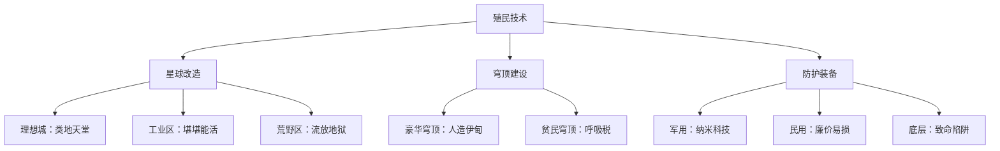

# 殖民学

[← 返回科技树总览](./index.md)

> **财团官方宣传**：*"我们正在将荒芜的星球改造成宜居的家园，为人类文明开拓无限的未来。殖民技术是人类向星辰大海进发的阶梯。"*

> **真实现状**：殖民不是为了"人类"，而是为了**财团的扩张**。星球改造技术被用来建造上层的"理想城"和底层的"劳工营"。穹顶之下，阶级依然森严。

## 🪐 星球改造

**发展水平**: ⭐⭐⭐ (理论成熟，实施缓慢)  
**财团控制度**: 🔴 完全垄断

### 技术原理

通过多种手段逐步改造星球环境，使其适合人类居住：
- **大气改造** - 释放温室气体提升温度,或引入藻类/植物产生氧气
- **水资源开发** - 融化极地冰盖,或从小行星运输水冰
- **磁场生成** - 部署轨道磁场发生器,防护太阳辐射
- **生态系统建立** - 引入经过基因改造的动植物,形成自维持生态圈

### 改造进程

**α星**（地球化程度25%）：
- 水资源极度匮乏,依赖运输水冰
- 除了各处"穹顶"城市之外,大部分区域仍是荒漠和岩石

**β星**（地球化程度100%）：
- 大气成分接近地球,可直接呼吸
- 完全建成理想城,但只有上层可以享受改造成果,底层仍生活在污染和贫困中
- 海洋覆盖率65%,淡水资源丰富
- 上层区域环境优美,下层区域全是工厂和贫民窟

**为什么改造这么慢？**  
泄露的内部文件揭示：*"完全改造α星需投入巨资,但目前的半宜居状态反而有利于控制——想要呼吸清洁空气,就得住在财团的穹顶城市里。环境劣势即控制优势。"*

## 🏛️ 隔离性生态穹顶建设

**发展水平**: ⭐⭐⭐⭐⭐ (高度成熟)  
**财团控制度**: 🔴 绝对垄断

### 技术原理

建造半球形或圆柱形透明穹顶,内部维持独立的生态系统:
- **结构材料** - 碳纳米管增强的透明复合材料,可抵挡陨石撞击和极端天气
- **生命支持** - 闭环空气循环、水净化系统、温控系统
- **能源供应** - 穹顶表面集成太阳能板,或外接核电站
- **农业区** - 内置垂直农场和合成食品工厂

### 穹顶类型

**豪华穹顶**（上层专属）：
- 面积达数平方公里,容纳数万人
- 内部模拟地球四季,有公园、湖泊、"人造天空"
- 空气质量优于地球,温度恒定舒适
- 代表：α星城市中央穹顶

**工业穹顶**（生产设施）：
- 仅保证基本气压和温度
- 空气质量差,充满工业废气
- 工人在有限的"休息穹顶"和"工作舱"间穿梭

**贫民穹顶**（底层聚居区）：
- 拥挤不堪,人均居住面积不足10平米
- 空气循环系统老化,充斥异味
- 定期"计划性断氧"（宣称"系统维护"）
- 穹顶墙壁用廉价材料,透明度差,采光不足

> **某穹顶维护工**：  
> *"我每天修理豪华穹顶的空气净化器,那里的空气纯净得像香水。然后我回到自己的贫民穹,呼吸着发霉的回收气。同一片天空下,我们呼吸的是两个世界。"*

## 🧑‍🚀 防护服

**发展水平**: ⭐⭐⭐⭐ (技术成熟)  
**财团控制度**: 🟡 部分控制（军用垄断，民用限制）

### 技术原理

用于在恶劣环境（真空、辐射、有毒大气）中保护人体的特殊服装：
- **密封结构** - 多层复合材料，完全隔绝外部环境
- **生命支持** - 内置氧气罐、温控系统、二氧化碳吸收装置
- **辐射防护** - 铅涂层或特殊纤维，减少辐射伤害
- **通讯系统** - 集成无线电和生命体征监控

### 装备分级

**军用/高级防护服**：
- 使用碳纳米管和纳米材料，轻便且防护力强
- 氧气供应可持续48小时
- 自修复功能（轻微破损可自愈）
- 集成AR显示、导航、武器接口
- **造价**：单件约50万信用点

**民用防护服**：
- 使用混合金属和合成橡胶，笨重且易损
- 氧气供应仅4-8小时
- 无自修复，破损即报废
- 基础通讯功能
- **造价**：单件约5000信用点

**底层"防护服"**：
- 二手或过期的淘汰品
- 常见问题：接缝渗漏、氧气罐失效、头盔裂纹
- 辐射防护几乎为零
- **黑市价格**：500-2000信用点
- **真实价值**：可能还不如不穿（虚假安全感导致冒险）

### 真实应用（生存权的货币化）

- **太空作业工人** - 被迫使用廉价防护服，事故率极高
- **星球表面劳工** - 在未改造区域工作，依赖劣质防护服
- **"租赁"陷阱** - 财团不提供防护服，而是"租赁"给工人，从工资中扣除
- **维修剥削** - 防护服损坏需自费维修，费用常高于工资

> **小行星采矿工遗书**（黎明之剑公布）：  
> *"今天我的防护服头盔出现裂纹。监工说'能用就继续用'，维修费要从我三个月工资里扣。如果你看到这封信，说明裂纹扩大了。对不起，我本想活着回去的。"*

**相关事件**：
- 2059年某小行星采集站集体事故，23名工人因防护服失效死亡

## 殖民技术体系

## 核心结论

殖民技术本可以让所有人类在星辰间自由生活，但在财团手中，它成为了**空间上的阶级隔离工具**。豪华穹顶与贫民穹、改造区与荒野区、高级防护服与淘汰品——每一项技术差异，都对应着生存权的不平等。

在双星文明，**连呼吸都是一种特权**。

## 相关链接

- [← 返回科技树总览](./index.md)
- [← 生物学](./biology.md)
- [熵澜能量学 →](./entropic.md)
- [欧加斯财团](../../organizations/index.md#欧加斯财团-the-ogas-consortium)
- [α星](../../locations/index.md#α星)
- [β星](../../locations/index.md#β星)
