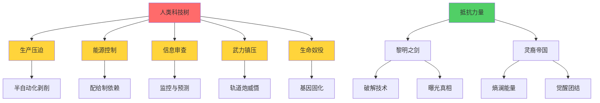

# 总结与反思

[← 返回科技树总览](./index.md)

## 技术垄断的真相

纵观整个人类科技树，一个残酷的事实清晰可见：

**财团掌握着足以让所有人过上富足生活的技术，却选择将其转化为压迫与剥削的工具。**

- **能源技术** - [核聚变](./energy.md#⚛️-核聚变（实验阶段）)可以终结能源短缺，却被故意延缓民用化，维持配给制控制
- **生产技术** - [全自动化](./production.md#🏙️-信息化工业基地)可以解放劳动力，却保留半自动化，维持债务奴役
- **材料技术** - [碳纳米管](./materials.md#🧵-碳纳米管)可以让建筑永不损坏，却垄断于军工，底层使用易损品
- **生物技术** - [基因编辑](./biology.md#👤-人类基因改造)可以消除疾病，却用于控制灵裔和固化阶级
- **殖民技术** - [星球改造](./colonization.md#🪐-星球改造)可以创造新家园，却建立起穹顶隔离的等级社会
- **武器技术** - [先进武器](./weapons.md)应守护文明，却成为镇压民众的屠刀

## 技术与权力

技术本身是中立的。核聚变不会自动成为武器，基因编辑不会自动成为枷锁。

**但在资本和权力的手中，任何技术都可能扭曲为压迫的工具。**

财团的逻辑很简单：
1. **垄断关键技术，掌控生死**
2. **制造人为稀缺，维持依赖**
3. **分化技术等级，固化阶级**
4. **以进步之名，行剥削之实**

## 技术领域对比

| 技术领域 | 财团/军方水平 | 民用水平 | 技术差距 | 控制目的 |
|---------|-------------|---------|---------|---------|
| [生产学](./production.md) | ⭐⭐⭐⭐⭐ 可全自动化 | ⭐⭐⭐ 半自动化 | 故意保留人力 | 维持劳动依赖 |
| [能源学](./energy.md) | ⭐⭐⭐⭐⭐ 核聚变 | ⭐⭐⭐ 老化核裂变 | 20年技术代差 | 能源配给控制 |
| [材料学](./materials.md) | ⭐⭐⭐⭐⭐ 碳纳米管 | ⭐⭐⭐ 混合金属 | 50年技术代差 | 计划性淘汰 |
| [计算学](./computing.md) | ⭐⭐⭐⭐⭐ 128位/量子 | ⭐⭐⭐ 限频64位 | 被刻意限制 | 监控与审查 |
| [武器科技](./weapons.md) | ⭐⭐⭐⭐⭐ 轨道炮/激光 | 🚫 完全禁止 | 绝对垄断 | 镇压手段 |
| [装甲技术](./armor.md) | ⭐⭐⭐⭐⭐ 纳米装甲 | ⭐ 几乎没有 | 不可逾越 | 战力压制 |
| [生物学](./biology.md) | ⭐⭐⭐⭐⭐ 基因完全掌控 | 🚫 严格管制 | 绝对禁止 | 阶级固化 |
| [殖民学](./colonization.md) | ⭐⭐⭐⭐⭐ 豪华穹顶 | ⭐⭐ 贫民穹顶 | 生存质量悬殊 | 空间隔离 |
| [熵澜能量学](./entropic.md) | ⭐⭐⭐ 仅能干扰 | ⭐⭐⭐⭐⭐ 灵裔天赋 | 财团无法掌控 | 唯一失败领域 |

## 抵抗的萌芽

然而，技术垄断终究无法永续。

在财团的铁幕之下，**黎明之剑**用缴获的武器、破解的技术、窃取的文件，一点点撕开真相的缺口：
- 泄露"窃火计划"，曝光[熵澜能量实验暴行](./entropic.md#🧪-熵澜能量窃取与移植（实验失败）)
- 公布[空间站债务合同陷阱](./production.md#🛰️-空间站)，唤醒太空工人觉悟
- 破解[监控系统](./computing.md#💾-64位计算机)，建立地下通讯网
- 缴获军用装备，武装反抗力量

**灵裔帝国**的觉醒，更是对财团技术霸权的直接挑战：
- [熵澜能量](./entropic.md)无法被完全压制
- 灵裔的团结超越了财团的分化
- 古老的力量对抗现代的傲慢

## 最终的启示

**双星文明的悲剧不是技术不够先进，而是技术掌握在错误的手中。**

当技术成为少数人压迫多数人的工具时，再辉煌的科技树也只是通往地狱的阶梯。

**技术不会拯救我们，只有正义才能。**

> **"他们用技术建造了天堂，却只让少数人进入。那么，余下的我们，就用同样的技术，推倒那扇紧闭的门。"**  
> —— 黎明之剑创始人宣言

## 科技树全景对比

## 关键警示

每一项技术的"进步"，都伴随着道德的退步：

| 技术成就 | 道德代价 |
|---------|---------|
| 空间站建设 | [太空债奴制](./production.md#🛰️-空间站) |
| 小行星开采 | [强制劳工与高死亡率](./production.md#☄️-小行星开采) |
| 合成粮食 | [营养剥夺与口粮控制](./production.md#🧪-合成粮食) |
| 核聚变研究 | [故意延缓民用化](./energy.md#⚛️-核聚变（实验阶段）) |
| 碳纳米管 | [计划性淘汰策略](./materials.md#🧵-碳纳米管) |
| 128位超算 | [预测性镇压系统](./computing.md#🖥️-128位计算机) |
| 轨道炮 | [对准自己的民众](./weapons.md#🚀-轨道炮系统) |
| 纳米装甲 | [不可逾越的镇压优势](./armor.md#🧬-纳米装甲) |
| 基因编辑 | [灵裔精神控制](./biology.md#🧠-灵裔控制技术（核心黑暗）) |
| 生态穹顶 | [呼吸权的阶级分化](./colonization.md#🏛️-隔离性生态穹顶建设) |
| 熵澜研究 | [非人道活体实验](./entropic.md#🧪-熵澜能量窃取与移植（实验失败）) |

## 未来的可能

技术的本质不会改变，但使用技术的人可以改变。

若黎明之剑和灵裔帝国能推翻财团的统治，同样的技术可以：
- **核聚变** - 为所有人提供清洁能源
- **全自动化** - 解放劳动，让人专注创造
- **碳纳米管** - 建造永久使用的基础设施
- **基因编辑** - 治愈疾病，而非制造奴隶
- **生态穹顶** - 成为人人可居的家园
- **计算网络** - 自由交流而非监控工具

但前提是，**技术必须服务于人民，而非资本与权力。**

## 相关链接

- [← 返回科技树总览](./index.md)
- [← 熵澜能量学](./entropic.md)
- [欧加斯财团](../../organizations/index.md#欧加斯财团-the-ogas-consortium) - 技术垄断的执行者
- [黎明之剑](../../organizations/index.md#黎明之剑-dawn-sword) - 对抗技术压迫的反抗组织
- [灵裔帝国](../../organizations/index.md#灵裔帝国-elysian-empire) - 用熵澜能量抵抗的觉醒者
- [第三街区净化行动](../../events/index.md#第三街区净化行动) - 财团技术镇压的起点
- [α星大屠杀](../../events/index.md#α星大屠杀) - 技术压迫的终极爆发
