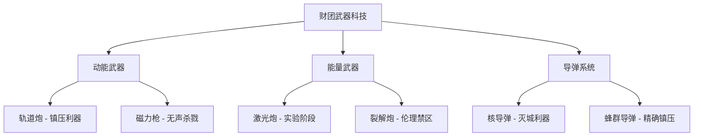

# 武器科技

[← 返回科技树总览](./index.md)

> **财团官方宣传**：*"先进的武器系统保障了双星文明的安全，守护着每一位公民的生命财产。"*

> **真实现状**：财团的武器技术压倒性地领先于任何潜在对手，但这些武器的真正目标从来都不是外星威胁，而是**镇压内部反抗**。轨道炮、能量武器、蜂群导弹——每一件都是为了对付手无寸铁的平民而设计。

## 动能武器

### 🚀 轨道炮系统

**发展水平**: ⭐⭐⭐⭐⭐ (高度成熟)  
**财团控制度**: 🔴 绝对垄断

**技术原理**：  
使用强大的电磁场将金属弹丸加速到极高速度（通常为5-10km/s），通过纯动能摧毁目标。不需要火药，弹药可就地取材（任何金属块），射程理论上无限（太空中无空气阻力）。

**主要型号**：
- **重型轨道加农炮**：战舰主炮，单发威力相当于50吨TNT，可击穿10米厚装甲
- **轨道近防机炮**：高射速点防御系统，拦截导弹和小型目标
- **中型副炮**：战舰辅助武器，兼顾火力和射速

**技术优势**：
- 弹药成本极低（金属块 vs 导弹）
- 射速快，可连续射击
- 穿透力极强，难以防御

**缺点**：
- 大气层内射程受限（空气阻力）
- 对于小型、快速移动目标效果有限
- 体积大，难以装备单兵/载具使用

**真实应用（镇压工具）**：
- **α星泰坦级防空炮系统** - 在阿尔法星大屠杀中被利用对着大气层，打击所有妄图进入或者离开的目标

### 🔫 磁力武器（单兵武器）

**发展水平**: ⭐⭐⭐⭐ (成熟应用)  
**财团控制度**: 🔴 军用垄断，民用部分允许

**技术原理**：  
单兵版的电磁加速武器，使用小型电磁轨道或线圈加速金属弹丸。威力介于传统枪械和爆炸物之间，但具有更高的穿透力和射程。由于不使用火药，枪口无火焰，但也有射击声音（类似于电弧声）。弹药可以是金属球、穿甲弹或特殊设计的碎片弹。

**主要型号**：
- **轨道突击步枪** - 防卫军制式武器，穿透力强，可击穿传统防弹衣
- **轨道狙击枪** - 射程远达3公里，弹道笔直
- **轨道手枪** - 军官配枪，威力足以击穿墙壁
- **轨道火箭发射器** - 发射小型制导火箭，用于反装甲

**军用 vs 民用**：
- **军用**：财团防卫军全员配备，弹药充足
- **民用**：民用市场允许销售简化版轨道武器，但射程和威力被限制

**镇压应用**：
- [第三街区净化行动](../../events/index.md#第三街区净化行动)中，防卫军使用轨道步枪"清场"，对手无寸铁的居民进行扫射
- 穿透力极强，贫民窟的简陋建筑完全无法提供掩护

## 能量武器（实验与镇压用）

**发展水平**: ⭐⭐⭐ (实验阶段，部分实战部署)  
**财团控制度**: 🔴 绝对保密

### 🔴 红激光发射器（太空武器）

**技术原理**：  
高能激光器聚焦能量束，瞬间加热目标表面使其气化或熔化。射程受限于光束扩散，但在太空中可达数千公里。需要巨大能量，通常只能装备战舰或轨道平台。

**应用现状**：
- 少数新型战舰装备实验性激光炮
- 主要用于拦截导弹和小型目标
- 对大型目标效果有限（能量分散）

**限制因素**：
- 能耗极高，需要核聚变堆持续供能
- 大气中效果大打折扣（散射和吸收）
- 冷却系统复杂，连续射击能力差

### ⚡ 裂解炮（实验性太空武器）

**技术原理**：  
一种极端危险的能量武器，通过高能粒子束破坏物质的分子键，使目标"裂解"成原子尘埃。理论威力巨大，但极不稳定。

**研发现状**：
- 仅在绝密实验室中存在
- 已发生多次实验事故，整个测试场被"蒸发"
- 财团内部对该技术存在分歧，有人认为"太过危险"
- 无法小型化，短期内不可能装备单兵使用

**伦理禁区**：
- 被裂解的目标会在极度痛苦中分解
- 传闻财团曾用灵裔进行活体测试
- 黎明之剑将其定性为"反人类武器"

> **泄露的实验录像记录**：  
> *"测试对象在光束照射下发出惨叫，身体逐渐变得透明...然后消失为灰烬。整个过程持续了7秒。"*

## 🚀 导弹科技

### 核导弹系统（太空武器）

**发展水平**: ⭐⭐⭐⭐⭐ (高度成熟)  
**技术原理**：  
装载核弹头的远程导弹，可携带多个分导式弹头（MIRV），每个弹头可独立攻击不同目标。制导系统精度达米级，几乎不可能拦截。

**主要用途**：
- **轨道清除** - 消灭敌方空间站和卫星
- **地面打击** - 对城市和军事基地的威慑和实际打击

### 🐝 蜂群导弹（太空武器）

**发展水平**: ⭐⭐⭐⭐⭐ (高度成熟，实战部署)  
**技术原理**：  
一种智能集群武器系统。单次发射数百枚小型导弹，通过AI协同定位和攻击目标。每枚导弹可独立决策，也可协同行动，形成"蜂群"围攻。

**作战特点**：
- 数量压制，难以全部拦截
- AI自主导航，抗干扰能力强
- 可攻击多个分散目标
- 成本相对较低，可大量生产

## 武器科技体系

## 核心结论

财团的武器技术远超任何潜在对手，但这种压倒性优势从未用于"保护公民"，而是**用于维持统治**。轨道炮朝向地面，蜂群导弹瞄准城市，核弹头悬在每个人头顶。

**相关事件**：
- [α星大屠杀](../../events/index.md#α星大屠杀) - **α星泰坦级防空炮系统**在阿尔法星大屠杀中被利用打击大气层所有妄图进入或者离开的目标
- [第三街区净化行动](../../events/index.md#第三街区净化行动) - 防卫军使用轨道步枪"清场"

## 相关链接

- [← 返回科技树总览](./index.md)
- [← 计算学](./computing.md)
- [装甲技术 →](./armor.md)
- [欧加斯财团](../../organizations/index.md#欧加斯财团-the-ogas-consortium)
- [α星防卫军](../../organizations/index.md#α星防卫军)
